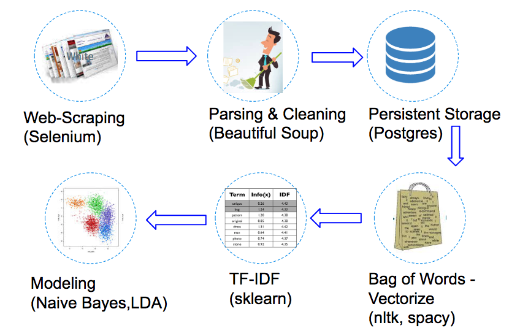

# Product Insights Based On Customer Reviews

1) About
2) Process
3) Implementation
4) Web Portal

# About

Analyzes Consumer Reviews to gain actionable insights on any given Product. The project uses three models - Multinomial Naïve Bayes Classifier, Latent Dirichlet Allocation and Word2Vec to identify key features within positive and negative reviews, cluster them into topics and find relationship between features, respectively. Selenium and Beautiful Soup is used to scrape and parse reviews and Natural Language Processing Pipeline vectorizes raw scraped text into TFIDF for analysis. Spacy and Gensim is used identify entities, phrases and sentiments.

Product owners interested in understanding what their customers are saying about their product can use this codebase to scrape online e-commerce sites, vectorize words and highlight key features.

Visit d3shopping.com for a demo of the product.

# Process (Problem Definition & Approach to Solution)

Reviews impact sales. Multiple surveys suggest a large percentage of consumers look at reviews before purchasing, trust reviews as much or more than personal recommendation resulting in increased sales and user engagement (click-through rates). For a product owner, this provides an instant feedback mechanism.

However, consumer reviews are notoriously messy. Reviews may or may not be descriptive and contain contradictory information within the same review. Additionally, depending on the product, there may be a lot of reviews (1000+) making it difficult to parse through the information. For a Product owner with multiple products or services, this becomes even a bigger challenge not to mention wanting to look at offerings from other competitors.

The solution to the problem is a automated system to collect, parse and analyze consumer reviews from multiple sources to gain actionable insights. This project provides the framework to do that. It contains a webscraper to scrape key e-commerce sites ( and more will be added with time ), parsing the scraped documents into structured format, storing structured information to a database, a pipeline to clean-up and vectorize, techniques to model the vectorized data and publish it via a webapp.

# Implementation

## Tech stack

## Pipeline

## Modeling

Standard nltk stopwords (with custom keywords), string punctuation and lemmatization was used to clean the data. Gensim's Phrases and Spacy's Parts of Speech were used to further parse relevant keywords and convert them two and three grams.

To gain insights, three different approaches are used - feature extraction from positive and negative reviews, clustering features through topic modeling and semantic insights into features via Word2Vec modeling.

The vectorized data from TFIDF was fed into sklearn's Multinomial. Positive reviews (rating = 4,5) and negative reviews ( rating = 1,2 ) were fed separately and feature log probabilities were used to determine highlight features. Spacy's parts of speech was used to identify nouns as features and adjectives as sentiments. Full corpus of documents after cleanup was fed into sklearn's LDA model to cluster features into topics. Similarly, full corpus of data from archived dataset was fed into Gensim's word2vec model to extract similarities between features.

# Set-up

After pulling down github repository, implement the following steps to get started.

1) set up Postgres Database. Instruction for setting Postgres DB are included in script/DB_setup file
2) Create reviews table using load sample data from data/sample_reviews.X_descr_vectors
3) Set-up Flask and start the application by calling 'python app.py' from the src directory.
